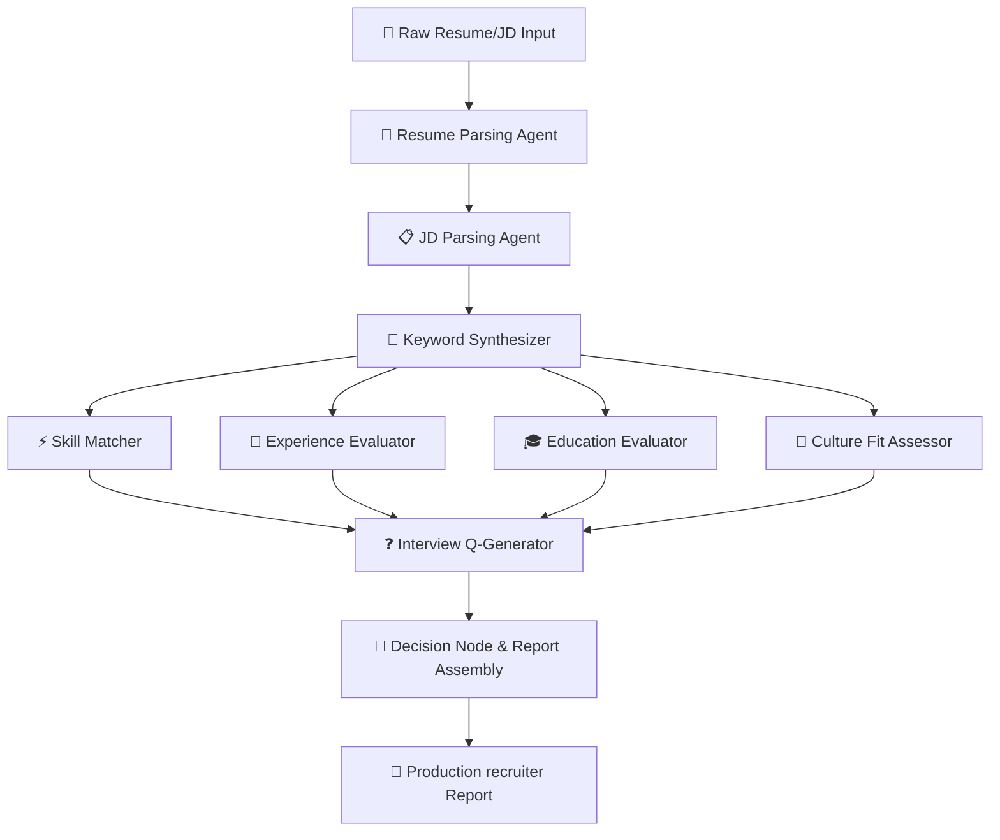

# 🌌 NEXUS-SCREENER: Autonomous Multi-Agent AI Recruiter

> **Hyper-Parallel Candidate Intelligence Engine** powered by LangGraph, Chainlit, and Google Gemini.

---

## ⚡ The Architecture: Multi-Agent Parallel Synapses

Nexus-Screener operates as a decentralized network of specialized neural agents that independently process, extract, and critique candidates across different dimensions concurrently. Agents communicate exclusively via a shared, immutable-in-step `GraphState` node system.



---

## 🚀 Key Systems

### 🧠 Core Cognitive Agents

*   **🛡️ Parsing Sentinels:** Instantly processes raw files (PDF/DOCX) using high-precision heuristics and converts unstructured metadata into strongly typed schemas.
*   **⚡ Skill Matcher (Fuzzy + LLM Hybrid):** Uses **RapidFuzz** token matching for sub-millisecond string alignment combined with Gemini's semantic engine to resolve synoynm discrepancies.
*   **💼 Experience Evaluator:** Scores total years, seniority, relevance, and trajectory against core JD requirements.
*   **🎓 Education Evaluator:** Cross-references academic pedigrees, certifications, and handles alternative qualification pathways.
*   **🤝 Culture Fit Assessor:** Deeply analyzes professional summaries against soft skills requirements using strict anti-hallucination guardrails.
*   **🎯 Final Decision Node:** Evaluates the aggregate state and computes the composite recommendation through a custom weighted scoring matrix.

---

## 🛠️ Deploying Nexus

### 1. Initialize Credentials
Clone `.env.example` to `.env` and fill in your Gemini API key:
```env
GOOGLE_API_KEY=AIzaSy...
GEMINI_MODEL=gemini-2.5-flash
GEMINI_TEMPERATURE=0
```

### 2. Synthesize Environment
Install all core agents and dependencies:
```bash
pip install -r requirements.txt
```

### 3. Launch UI Control Console
Boot up the Chainlit application control dashboard:
```bash
chainlit run app.py --watch
```

---

*Engineered for modern high-scale talent operations. Weighted scoring matrix configured at: `src/agents/decision_agent.py`*
